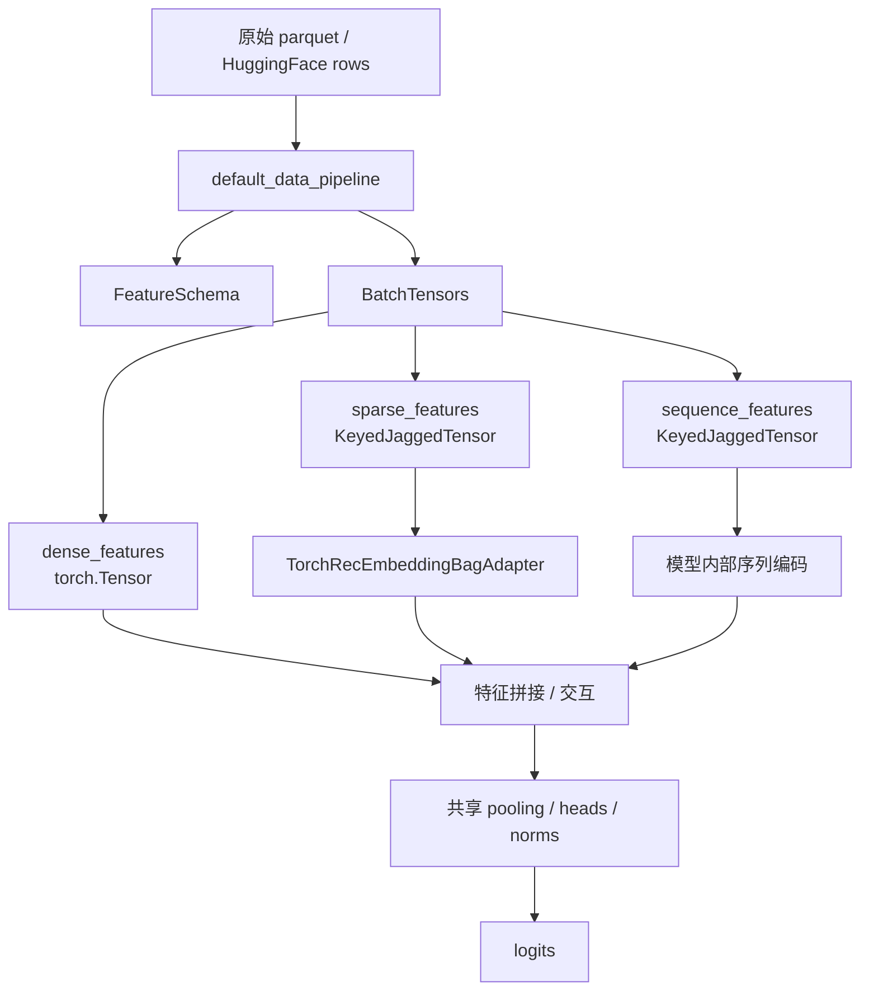
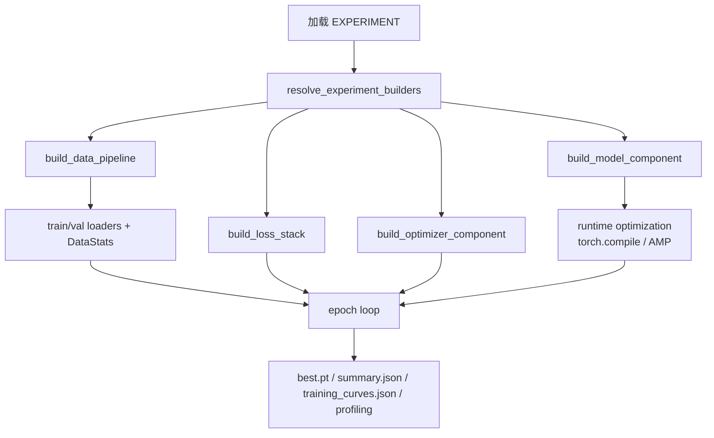

# 架构与概念

## 工程结构

```
TAAC_2026/
├── src/taac2026/          # 共享框架（不含具体模型实现）
│   ├── domain/            # 领域模型：配置、指标、运行时
│   ├── application/       # 应用层：训练、评估、搜索、报告 CLI
│   └── infrastructure/    # 基础设施：实验加载、数据集解析、GPU 调度
├── config/                # 目录式实验包（每个包独立）
├── tests/                 # 测试套件
├── docs/                  # 文档
└── outputs/               # 训练输出产物（git 忽略）
```

## 核心抽象

### ExperimentSpec

## 工程结构

```
TAAC_2026/
├── src/taac2026/domain/            # 配置、ExperimentSpec、FeatureSchema、BatchTensors
├── src/taac2026/application/       # 训练、评估、搜索、报告 CLI 与服务层
├── src/taac2026/infrastructure/    # 数据管道、TorchRec 适配器、共享 nn 组件、实验加载
├── config/                         # 10 个目录式实验包
├── tests/                          # 单元 / 集成 / GPU 测试
├── docs/                           # 文档站点
└── outputs/                        # 训练与评估产物（git 忽略）
```

## ExperimentSpec 合约

当前框架遵循“默认实现 + Callable 逃生口”的模式。实验包仍然保留完整自由度，但大多数包已经不再需要自写 data / loss / optimizer builder。

```python
@dataclass(slots=True)
class ExperimentSpec:
    name: str
    data: DataConfig
    model: ModelConfig
    train: TrainConfig

    feature_schema: FeatureSchema | None = None

    build_data_pipeline: Callable | None = None
    build_model_component: Callable = ...
    build_loss_stack: Callable | None = None
    build_optimizer_component: Callable | None = None

    switches: dict[str, bool] = field(default_factory=dict)
    search: SearchConfig = field(default_factory=SearchConfig)
    build_search_experiment: Callable | None = None
```

框架入口会通过 `resolve_experiment_builders()` 把 `None` builder 自动解析到共享默认实现：

- 数据管道：`default_build_data_pipeline()`
- 损失：`default_build_loss_stack()`
- 优化器：`default_build_optimizer()`

这让 baseline、ctr_baseline、grok、hyformer、interformer、onetrans、oo、uniscaleformer 都可以只保留模型核心代码；目前仍显式自定义 optimizer builder 的实验包是 DeepContextNet 和 UniRec。

## 数据流



### BatchTensors

当前 `BatchTensors` 已经从旧的“多组 padded token + mask”表示迁移到更统一的批处理结构：

- `sparse_features`：所有候选 / 用户 / 上下文等稀疏 token 特征
- `sequence_features`：行为序列特征
- `dense_features`：稠密数值特征
- `labels`、`user_indices`、`item_indices`、`item_logq`

其中稀疏与序列特征都可以直接映射到 TorchRec 的 `KeyedJaggedTensor` 路径。

## 共享基础设施

### 特征与数据管道

- `FeatureSchema` 统一声明表名、family、embedding 维度、pooling 策略与序列属性
- `default_data_pipeline` 负责从 parquet/HF 行构建 `BatchTensors`
- `sparse_collate` 负责把 masked dense batch 转成 `KeyedJaggedTensor`

### 嵌入层

- `TorchRecEmbeddingBagAdapter` 封装 `EmbeddingBagCollection`
- 实验包不再直接管理 `nn.Embedding`
- 稀疏特征按 schema 选择表并输出拼接后的 pooled embedding

### 共享神经网络组件

当前已经稳定共享的组件：

- `pooling.py`：`masked_mean`、`MaskedMeanPool`、`TargetAwarePool`
- `heads.py`：`ClassificationHead`
- `norms.py`：`rms_norm()`、`RMSNorm`
- `optimizers.py`：`Muon`、`CombinedOptimizer`、`build_hybrid_optimizer()`
- `transformer.py`：`TaacTransformerBlock`、`TaacCrossAttentionBlock`
- `hstu.py`：`HSTUBlock`、`TimeAwareHSTU`、`BranchTransducer`、`MixtureOfTransducers`、`BlockAttnRes`、时间偏置 / RoPE helper
- `quantization.py`：评估侧动态 int8 量化入口（torchao `nn.Linear` 主路径；TorchRec `EmbeddingBagCollection` 显式不支持 int8）
- `triton_norm.py`：首个 Triton RMSNorm kernel 与测试支架

这些组件已经覆盖了主干里的共享注意力、RMSNorm、HSTU 与混合优化器路径；当前未完成的重点收尾转为 fp8 kernel，以及基于 benchmark 的最终验收报告。

## 训练与评估流程



训练服务会统一处理：

- `torch.compile` 与 AMP 选项
- 训练 / 验证循环
- checkpoint 与 profiling 产物落盘
- Optuna search 过程中对 ExperimentSpec 的派生与覆写

评估 CLI 复用相同的实验包定义，并支持在 `single` / `batch` 模式下额外打开编译、AMP、CPU 动态 int8 量化，以及 `torch.export` 评估图导出。

## 配置对象

核心配置分为四个 dataclass：

- `DataConfig`：数据集路径、序列长度、dense 维度、切分比例等
- `ModelConfig`：embedding / hidden 维度、层数、头数、各种子结构参数
- `TrainConfig`：epochs、batch size、学习率、AMP、compile、输出目录
- `SearchConfig`：Optuna trial 数、时间预算、参数量限制、推理时延预算

这些配置既用于训练 / 评估，也用于测试里的最小实验包构造。

## 指标与输出产物

共享指标实现位于 `src/taac2026/domain/metrics.py`，当前评估报告会输出：

- AUC
- PR-AUC
- Brier Score
- LogLoss
- GAUC
- mean / p95 latency

标准运行目录会包含：

- `best.pt`
- `summary.json`
- `training_curves.json`
- `profiling/`

## 当前边界

当前仓库已经完成 TorchRec 稀疏特征、默认 builder、共享 HSTU 原语和 GPU CI 收口，但仍未完成以下计划项：

- Triton attention / FFN 的 fp8 路径
- Muon 的 Triton 化矩阵投影
- 基于 benchmark 的最终 AUC / 时延验收报告

文档中的架构描述以已经合并到仓库的实现为准，而不是以重构计划中的目标态为准。
